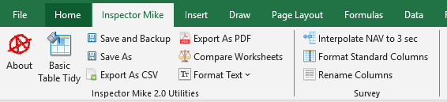
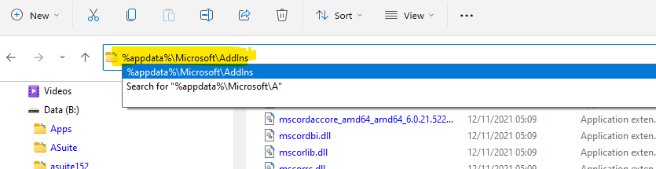
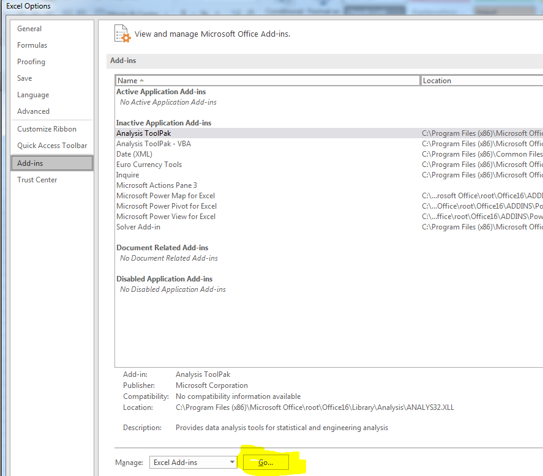

# Inspector Mike - Excel Addin 

Inspector Mike is an Excel add-in containing utility routines developed over many years, originally dating back to 2004.

It is designed to streamline repetitive inspection/reporting tasks, standardise worksheet formatting, support event/logging workflows, and provide a framework for client-specific data processing tools.

## Repository Contents

GitHub includes:

- Extracted VBA module listings for convenience: `./Modules`
- Extracted XLAM contents for tracking Ribbon XML and custom images: `./InspectorMike_Addin`
- End-user documentation that may be deployed with the XLAM: `./InspectorMike_Addin_docs`

## .xlam Installation

- Close Excel, and use Task Manager to ensure there isn\'t a frozen
  instance of Excel still present
- Find "InspectorMike_Addin.xlam"
- Copy "InspectorMike_Addin.xlam" to the correct location on your PC
- Destination folder has to be: **%appdata%\\Microsoft\\Addins**
  - (Just paste %appdata%\\Microsoft\\Addins into the address bar in
    Windows explorer and hit enter)

- Once InspectorMike_Addin.xlam is installed in the correct folder, Open
  Excel, then navigate to File -- Options -- Add-ins -- "Go..."
  - 

## Upgrade

- Close Excel
- Locate the updated file "InspectorMike_Addin.xlam"
- Update the file "InspectorMike_Addin.xlam" in the installed location
  ("%appdata%\\Microsoft\\Addins")
- Re-open Excel
- Use the "About" add-in to confirm the "last update" date for the newly
  installed INSPECTORMIKE add-ins

## Operation

## Warnings

- Assume the worst; back up often.
- Error checking is limited.
- Some routines are designed for specific worksheet layouts. Running them on an unsupported sheet may produce unexpected results.
- This is especially true for the Nexus and VisualSoft tools.

# History

- Initial routines developed by Mike Thompson (while employed by
  Netlink, but subcontracted to Covus) in March 2003 on Malampaya.
- Framework formalised by Chris Merrick on CNOOC inspection in Aug 2004.
  Expansion of framework planned by Chris, implemented by Mike. Mike and
  Chris employed by Netlink, but subcontracted to CalDive
- Decision made by Netlink Inspection to release these routines free for
  use with no documentation and no support.
- 2004 -- 2007: Minor improvements during subsequent Malampaya
  inspections.
- 2005: Significant expansion of routines into assisting database import
  and export between various client databases and Nexus
- 2007: Mike Thompson departs Netlink and becomes Freelance (addin
  renamed)
- 2008: Final form of routines for Malampaya inspection
- 2007 -- 2009: Continued use and minor modifications by Mike Thompson.
  Copies of routines left on various client systems across the world.
- 2014: Mike Thompson employed by DOF (addin renamed)
- 2015: Commenced re-development of routines to assist with data
  exported from Coabis and to and from VisualSoft during Chevron
  campaigns
- 2016: Ongoing development of VisualSoft routines
- 2017: Deleted many modules not applicable to INSPECTORMIKE and
  transition from "Unmanaged Macros" to "Official Addin", and the
  generation of this documentation. (Talisman EventExport module left in
  case improvements from that job are requested elsewhere)
- 2018-03: Updates to Nexus Export to assist with Prelude Reporting (new
  module -- LibraryFiles)
- 2022 -- Updates to assist processing on Malampaya campaign following
  disastrous upgrade to Nexus 6. (Added LibrarySurvey and
  LibraryInterpolation, and migrated some existing routines to these
  locations)
- 2025 Mike Thompson back to freelance. Addin renamed. Removed DOF
  Proprietry Code, added unit tests, added routines for Fugro software,
  refactoring
Historically, this code had no formal version management. Too many changes were lost or mismanaged over the years. In 2026, preparation began to bring the project under GitHub source control.

## TODO

- Continue adding unit tests
- Remove `ActiveSheet` assumptions and explicitly pass worksheet references
- Restrict macros so they only run in supported contexts
- Add and persist user settings

# Development Notes

2018: Ribbon UI handled through OfficeCustomUIEditorSetup.msi
2022 -- Ribbon UI management moved to forked project following Microsoft dropping support for the original
> <https://github.com/fernandreu/office-ribbonx-editor>
>
> Updated build stored in same locations as above, but no longer needs
> to be installed

Documentation for OfficeCustomUIEditorSetup:
> Instead of the below, please use the links in the Help menu using the
> updated Ribbon UI Manager from github

- <https://gregmaxey.com/word_tip_pages/ribbon_custom_icons.html>
- <https://stackoverflow.com/questions/15409457/vba-error-wrong-number-of-arguments-or-invalid-property-assignments-when-runni>

- <https://msdn.microsoft.com/en-us/library/cc508991(office.11).aspx#UsingtheCustomUIEditor2_AddingTemplatestotheCustomUIEditor>
