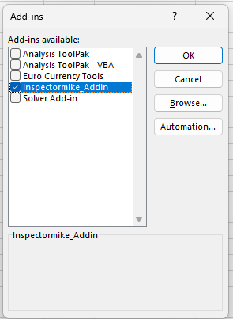

# Inspector Mike - Excel Addin 

## Background

The routines contained within InspectorMike_Addin.xlam have been
developed over time, being started in 2004.

They are designed to:

- Streamline repetitive tasks

- Ensure consistent formatting for deliverables

- Provide enhanced functionality over that possible in the original
  application.

## Installation

- Close Excel, and use Task Manager to ensure there isn\'t a frozen
  instance of Excel still present

- Find "InspectorMike_Addin.xlam"

- Copy "InspectorMike_Addin.xlam" to the correct location on your PC

- Destination folder has to be: **%appdata%\\Microsoft\\Addins**

  - (Just paste %appdata%\\Microsoft\\Addins into the address bar in
    Windows explorer and hit enter)

  - 

- Once InspectorMike_Addin.xlam is installed in the correct folder, Open
  Excel, then navigate to File -- Options -- Add-ins -- "Go..."

  - 

## Upgrade

- Use the "About" add-in to confirm the "last update" date for the
  installed INSPECTORMIKE add-ins

- Close Excel

- Locate the updated file "InspectorMike_Addin.xlam"

- Update the file "InspectorMike_Addin.xlam" in the installed location
  ("%appdata%\\Microsoft\\Addins")

- Re-open Excel

- Use the "About" add-in to confirm the "last update" date for the newly
  installed INSPECTORMIKE add-ins

## Operation

### Warnings

- Assume the worst, backup often

- There is minimal error checking within these routines

- Assume the worst, backup often

- If a routine is used on a sheet it wasn't designed for, then, well,
  let's just say there may not be a happy ending. This is more true for
  the Nexus and VisualSoft Tools.

- Assume the worst, backup often

- The following documentation is more to ensure the Use-Case for each
  routine is understood

- Assume the worst, backup often

### About

Primarily implemented to allow versioning using the "Last Updated" date
and "Recent Changes". Opens a web page. Excel will mildly complain, go
ahead and allow it to open this page.

# History

- Initial routines developed by Mike Thompson (while employed by
  Netlink, but subcontracted to Covus) in March 2003 on Malampaya.

- Framework formalised by Chris Merrick on CNOOC inspection in Aug 2004.
  Expansion of framework planned by Chris, implemented by Mike. Mike and
  Chris employed by Netlink, but subcontracted to CalDive

- Decision made by Netlink Inspection to release these routines free for
  use with no documentation and no support.

- 2004 -- 2007: Minor improvements during subsequent Malampaya
  inspections.

- 2005: Significant expansion of routines into assisting database import
  and export between various client databases and Nexus

- 2007: Mike Thompson departs Netlink and becomes Freelance (addin
  renamed)

- 2008: Final form of routines for Malampaya inspection

- 2007 -- 2009: Continued use and minor modifications by Mike Thompson.
  Copies of routines left on various client systems across the world.

- 2014: Mike Thompson employed by DOF (addin renamed)

- 2015: Commenced re-development of routines to assist with data
  exported from Coabis and to and from VisualSoft during Chevron
  campaigns

- 2016: Ongoing development of VisualSoft routines

- 2017: Deleted many modules not applicable to INSPECTORMIKE and
  transition from "Unmanaged Macros" to "Official Addin", and the
  generation of this documentation. (Talisman EventExport module left in
  case improvements from that job are requested elsewhere)

- 2018-03: Updates to Nexus Export to assist with Prelude Reporting (new
  module -- LibraryFiles)

- 2022 -- Updates to assist processing on Malampaya campaign following
  disastrous upgrade to Nexus 6. (Added LibrarySurvey and
  LibraryInterpolation, and migrated some existing routines to these
  locations)

- 2025 Mike Thompson back to freelance. Addin renamed. Removed DOF
  Proprietry Code, added unit tests, added routines for Fugro software,
  refactoring

There's been no version management of this code. I don't want to talk
about how many changes I've lost or mismanaged over the years... (2026
started prep for addition to github)

## TODO

- Continue adding unit Tests (only 5 modules to date)

- Eliminate ActiveSheet assumptions. Explicitly call worksheet etc

- Only allow each Macro to be run in correct case

- Offer the user settings (as per VisualSoft export)

- Persist user settings

- Version/Change Management

# Development Notes

2018: Ribbon UI handled through OfficeCustomUIEditorSetup.msi

2022 -- Ribbon UI management moved to forked project following Microsoft
dropping support for the original

> <https://github.com/fernandreu/office-ribbonx-editor>
>
> Updated build stored in same locations as above, but no longer needs
> to be installed

Documentation for OfficeCustomUIEditorSetup:

> Instead of the below, please use the links in the Help menu using the
> updated Ribbon UI Manager from github

- <https://gregmaxey.com/word_tip_pages/ribbon_custom_icons.html>

- <https://stackoverflow.com/questions/15409457/vba-error-wrong-number-of-arguments-or-invalid-property-assignments-when-runni>

- <https://msdn.microsoft.com/en-us/library/cc508991(office.11).aspx#UsingtheCustomUIEditor2_AddingTemplatestotheCustomUIEditor>
